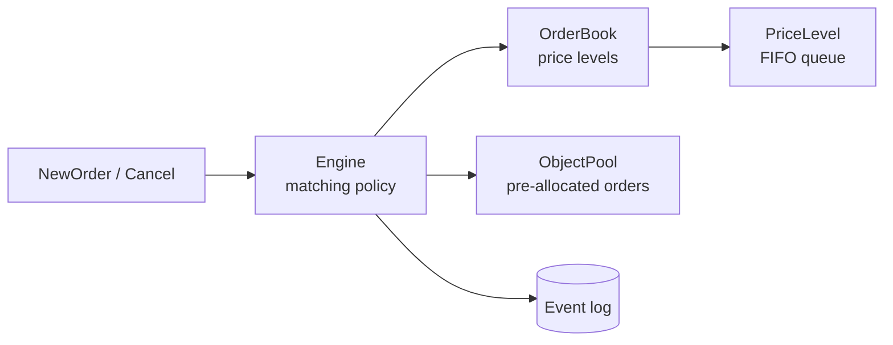

# Matching Engine

[](https://github.com/cheungscott/matching-engine/actions/workflows/ci.yml)

A single-symbol order matching engine in C++23 that matches orders by price-time priority
and records every outcome in a sequenced event log.

## Features

- Limit and market orders, partial fills, multi-level sweeps, and cancel by order id
- Price-time priority: best price first, then arrival order within a price
- Sequenced event log with deterministic replay
- The engine makes no heap allocation after construction: orders use a pre-allocated pool.
  `apply()` appends to the caller's `std::vector<Trade>`, which must be empty on entry and
  reserved to `max_trades_per_apply()` entries. An attached event sink is excluded from
  this guarantee: it can allocate per event.
- Rejected orders return a reason through `std::expected`
- Single-threaded core

## Architecture



`Engine` makes all matching decisions. `OrderBook` stores resting orders by price and never
matches on its own.

## Testing

Every test runs under AddressSanitizer and UndefinedBehaviorSanitizer. CI builds and tests on
g++ 12, 13 and 14.

- **Differential testing** compares results after every operation against `NaiveBook`,
  a simple `std::map` reference implementation
- **Book invariants** are checked after every operation in a 100,000-operation randomised run
- **Event-log properties** are checked over a 1,000,000-operation randomised run: trades print
  at the maker's price, no order fills beyond its quantity, and a cancelled order never trades
- **Conservation** checks account for every order's quantity as filled, resting or cancelled
- **Checker tests** use planted violations to confirm each checker fails as expected

## Performance

Measured on 2026-09-06 under WSL2 with g++ 12 and `-O2 -DNDEBUG`, using a seeded synthetic
workload of limit orders with 30% cancels. Ten runs, each the median of five:

| Metric | Range (n=10) | Median |
|---|---|---|
| p50 latency | 46 to 46 ns | 46 ns |
| p99.9 latency | 390 to 414 ns | 399 ns |
| Throughput | 25.48 to 26.63 M ops/sec | 26.375 M ops/sec |

Separate passes measure latency and throughput because timing each operation roughly
halves throughput. WSL2 runs on a virtualised core that cannot be isolated, so tail latency includes
hypervisor noise and results vary between sessions. These are not bare-metal figures.

## Build

Requires Linux or WSL, CMake, Ninja and g++ 12 or newer.

```bash
sudo apt-get install -y ninja-build g++-12
```

Build and run the tests:

```bash
cmake --preset debug
cmake --build --preset debug
ctest --preset all
```

`ctest --preset all` includes the fuzz suite, which takes several minutes under the sanitizers.
`ctest --preset fast` skips it. The fuzz suite replays fixed seeds by default.
Setting `ME_FUZZ_SEED` to any string gives new input to the two randomised search tests:
the 1,000,000-operation property run and the 100,000-operation differential run. The shrinker
test keeps its fixed input.

Build and run the benchmarks:

```bash
cmake --preset bench
cmake --build --preset bench
./build-bench/bench_latency
```

## Layout

```
include/me/        engine, order book, price level, object pool, id index, events
tests/             test suite, NaiveBook reference, properties, shrinker
bench/             latency, allocation profiling, comparison against NaiveBook
tools/             benchmark and profiling scripts
```
